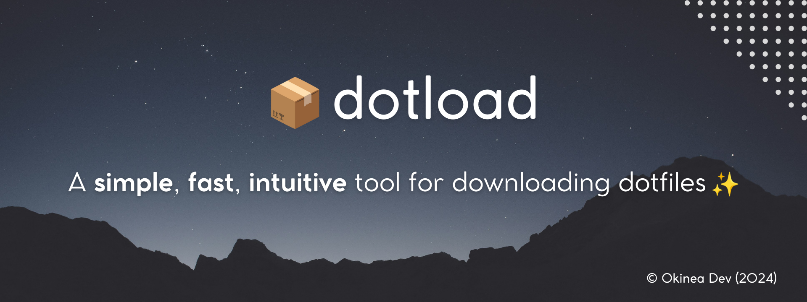
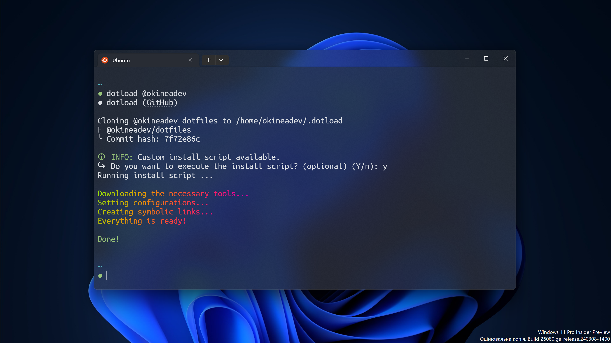

<!-- markdownlint-disable no-inline-html first-line-h1 -->

![GitHub Release Date][github-release-date]
![GitHub Actions Workflow Status][github-actions-workflow-status]
![GitHub Issues or Pull Requests][github-issues]
![GitHub License][github-license]
![Made with love][made-with-love]
![GitHub Repo stars][github-stars]

<!-- PROJECT LOGO -->
<div align="center">
  <a href="https://github.com/okineadev/dotload">
    
  </a>

  <h3 align="center">dotload</h3>

  <p align="center">
    <p>
    <b>dotload</b> - це <b>простий</b>, <b>інтуїтивний</b> та <b>швидкий</b>⚡ інструмент для встановлення конфігурацій (дотфайлів) та інших необхідних інструментів на будь-яку машину!</p>
    <a href="#%EF%B8%8F-Встановлення"><b>Встановлення</b></a>
    ·
    <a href="https://github.com/okineadev/dotload/issues/new?labels=bug&template=bug_report.md"><b>Повідомити про помилку</b></a>
    ·
    <a href="https://github.com/okineadev/dotload/issues/new?labels=enhancement&template=feature_request.md"><b>Запропонувати функцію</b></a>
  </p>
</div>

<a href="../../README.md">
</a>

## ℹ️ Про проект



`dotload` працює шляхом клонування репозиторію `dotfiles` з **GitHub** вказаного користувача

Цей інструмент було створено для того, щоб **максимально спростити** встановлення дотфайлів, необхідних інструментів для розробки (таких як **nodejs**, **php**, тощо.) та інших пакетів.

### 🤔 Як він працює?

Цей інструмент робить символічні посилання на ваші дотфайли з `~/.dotload` в папку `$HOME`

Він також може робити символічні помилання на папки (разом з вкладеними файлами), назва яких починається на крапку, наприклад `.configs`

> [!WARNING]
> Дотфайли з ідентичними назвами безвідворотньо перезапишуться на нові з вашого репозиторію!

Наприклад якщо у вас на комп'ютері та у репозиторії є файл `~/.bashrc` - то він перезапишеться новим з репозиторію. Перед тим як їх клонувати, переконайтесь що вони ваші, або ви зробили резервну копію попередніх конфігурацій

## ⚙️ Встановлення

Ви можете встановити `dotload` за допомогою цих пакетних менеджерів:

<details>
  <summary><b>apt (PPA) (Рекомендовано) ✅</b></summary>
  <br/>

  З цим методом ви отримуватимете подальші оновлення

  ```bash
  sudo add-apt-repository ppa:salumin/tools
  sudo apt update
  sudo apt install dotload
  ```

</details>

<details>
  <summary><b>З install.sh</b></summary>
  <br/>

  З цим методом, ви можете встановити dotload практично на **будь-якій системі**, в тому числі в Termux

  📥 **Встановлення**:

  ```bash
  curl -sL https://raw.githubusercontent.com/okineadev/dotload/main/install.sh | bash
  ```

  🗑️ **Видалення**:

  ```bash
  sudo rm $PREFIX/bin/dotload && hash -r
  ```

  > ℹ️ Примітка: Якщо ви хочете видалити цей інструмент з **Termux**, вам потрібно виконати вище вказану команду без `sudo`

</details>

<!-- Temporary closed because useless -->
<!-- <details>
  <summary><b>Snap ⚠️</b></summary>
  <br/>

  > ⚠️ **УВАГА**: Версія пакету зі **snap** може не працювати з кастомними скриптами інсталяції

  ```bash
  curl -LO https://github.com/okineadev/dotload/releases/download/v1.1.0/dotload_1.1.0_all.snap
  sudo snap install dotload_1.1.0_all.snap --dangerous
  ```

</details> -->

Також ви можете запустити його без встановлення на **будь-якій** ОС за допомогою цієї команди:

```bash
bash <(curl -sL https://github.com/okineadev/dotload/releases/latest/download/dotload) @username
```

## 🚀 Використання

```bash
dotload @username
dotload https://github.com/username/dotfiles.git
```

Де `username` - це **ім'я користувача GitHub**, чиї дотфайли ви хочете клонувати.

> [!WARNING]
> Ім'я користувача не може містити емодзі, пробіли або інші нестандартні символи

### Розширене використання

```bash
dotload @username branch_name
```

> [!TIP]
> Ви також можете використовувати прапорці `-b` або `--branch`:

```bash
dotload @<username> [--branch branch_name | -b branch_name]
dotload <repo_url> [--branch branch_name | -b branch_name]
```

Де `branch_name` - назва гілки сховища, яку ви хочете клонувати. Якщо не вказано, буде використано гілку за замовчуванням. Це може бути корисно, якщо у вас є кілька сценаріїв використання машини

---

Використовуйте прапорець `--help` для отримання довідки:

```bash
dotload --help
# Сторінка довідки...
```

Також наявна підтримка `manpages`:

```bash
man dotload
```

### Кастомні скрипти встановлення

Ви також можете додати скрипт інсталяції до вашоро репозиторію `dotfiles`, щоб повністю автоматизувати встановлення та отримати більше можливостей

Інсталяційний файл може мати наступні назви та розташування:

- _install.sh_
- _install_
- _bootstrap.sh_
- _bootstrap_
- _script/bootstrap_
- _setup.sh_
- _setup_
- _script/setup_

Якщо жоден з цих файлів не знайдено, будь-які файли або папки у вибраному вами репозиторії dotfiles, що починаються з `.`, для них будуть створені символічні посилання в директорії `$HOME`.

### Конфігурація

Ви також можете **вказати власну назву скрипта інсталяції**
або зробити його необов'язковим у файлі `dotload.conf`, для цього прочитайте [**документацію по `dotload.conf**](dotload_conf.md)

## 🛣️ Дорожня карта

- [ ] Додати багатомовну підтримку **README.md**
  - [x] 🇺🇦 Українська
  - [ ] 🇵🇱 Польська
  - [ ] 🇩🇪 Німецька
- [ ] Написати інструкцію для розробників (по збірці пакету)
- [ ] Додати варіанти встановлення, такі як **Snap**, **AUR**, **RPM**
  - [x] **Snap**
  - [ ] **AUR**
  - [ ] **RPM**

## 🤝 Внески

Внески - це те, що робить спільноту з відкритим вихідним кодом таким чудовим місцем для навчання, натхнення та творчості. Будь-який ваш внесок **дуже цінний**.

Ви можете моментально розпочати розробку в **GitHub Codespaces**

[](https://codespaces.new/okineadev/dotload?quickstart=1)

Цей репозиторій містить ⚡ **prebuilds**, які дозволяють **пропустити** встановлення пакетів і інструментів

Або скористайтеся звичайним способом на комп’ютері:

1. Форкніть проект
2. Створіть гілку з вашими змінами (`git checkout -b feature/AmazingFeature`)
3. Зафіксуйте ваші зміни (`git commit -m 'Add some AmazingFeature'`)
4. Надішліть зміни (`git push origin feature/AmazingFeature`)
5. Відкрийте **PR** (Pull Request)

Будь ласка, переконайтеся, що ви оновили тести належним чином.

Також, будь ласка, прочитайте наш [**Кодекс поведінки**](../../CODE_OF_CONDUCT.md) і дотримуйтесь його у всіх ваших взаємодіях з проектом.

## 📝 Ліцензія

Цей проект ліцензію [**MIT**][mit-license-link].

Дивіться [**LICENSE**](../../LICENSE)

## 📨 Контакти

**Telegram:** [**@Okinea**][telegram-link]

## ❤️ Підтримка

Цей проект є повністю **безкоштовним** та з **відкритим кодом**.
Якщо вам сподобався цей інструмент - я буду дуже вдячний, якщо ви зможете підтримати мене фінансово

Ось реквізити для переказів:

- 🍩 **Donatello**: <https://donatello.to/okineadev>
- 🫙 **Банка для донатів**: <https://send.monobank.ua/jar/6rUVs4yasg>
- 💎 **TON гаманець**: `UQBaBIBtKJpdwc4jKSGd70LZyQnEf-Nx5edzZlZAAGkHnZ7E`

[github-release-date]: https://img.shields.io/github/release-date/okineadev/dotload
[github-actions-workflow-status]: https://img.shields.io/github/actions/workflow/status/okineadev/dotload/release.yml
[github-issues]: https://img.shields.io/github/issues/okineadev/dotload?color=shine-green
[github-license]: https://img.shields.io/github/license/okineadev/dotload
[made-with-love]: https://img.shields.io/badge/made_with-%E2%9D%A4%EF%B8%8F-white
[github-stars]: https://img.shields.io/github/stars/okineadev/dotload
[telegram-link]: https://t.me/okinea 'Telegram link'
[mit-license-link]: https://opensource.org/license/MIT
